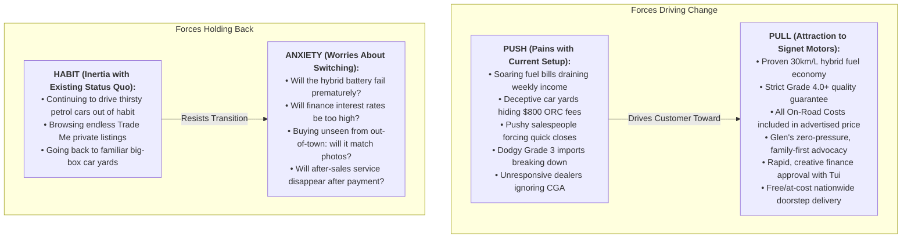

# Product Marketing Context: Signet Motors

**Document version:** v1  
**Last updated:** 2026-10-09  

---

## Product Overview

**One-liner:**  
Signet Motors is Auckland's premier hybrid vehicle and direct-import used car specialist—delivering certified high-grade Japanese and European vehicles (Grade 4.0+ only) with transparent, all-inclusive pricing, zero-pressure sales advocacy, fast flexible finance, and nationwide at-cost delivery.

**What it does:**  
Signet Motors (operated by Signet 2011 Limited, Registered Motor Vehicle Trader M299792) sources, imports, prepares, retails, and finances high-quality used vehicles across New Zealand. Operating from their primary yard at 4135 Great North Road, Glen Eden, Auckland 0602—supported by two additional vehicle storage yards—Signet specializes in fuel-efficient hybrid cars (Toyota, Lexus, Honda, Nissan) and quality European/Japanese wagons, sedans, SUVs, and commercial vans. Their end-to-end service encompasses Japanese auction hand-picking (minimum Grade 4.0), JEVIC certified odometer verification, stringent NZ compliance and VTNZ/AA safety inspection, full mechanical servicing and top-to-bottom detailing, tailored automotive financing with fast turnaround, transparent trade-in appraisals, concierge test drives (at home or work), custom vehicle pre-orders from Japan, and nationwide contactless car delivery.

**Product category:**  
Auckland used car dealership, NZ hybrid car specialist, Japanese direct import car dealer, Glen Eden used cars, West Auckland motor vehicle trader, eco-friendly hybrid cars NZ, JEVIC certified used cars, Trade Me verified motor dealer, used car finance Auckland, Japanese auction pre-order specialist NZ.

**Product type:**  
Automotive retail dealership, vehicle direct importer, and automotive financial services provider (physical dealership yard + digital contactless ecommerce/remote car buying experience).

**Business model:**  
Retail vehicle sales, trade-ins, Japanese auction indent pre-orders, and automotive financial brokerage:
- **Vehicle Inventory Sales:** High-volume, high-turnover used vehicles ranging from affordable entry-level commuters and ride-share hybrids ($8,000–$16,000) through mid-range family SUVs/wagons ($16,000–$28,000) to premium executive hybrids and luxury European vehicles ($28,000–$50,000+).
- **All-Inclusive "No Hidden Fees" Pricing:** All advertised prices include On-Road Costs (ORC)—meaning 12-month Warrant of Fitness (WOF), registration, brand new NZ number plates, full service (oil and filter), and complete professional vehicle groom are included without the standard $500–$800 dealer surcharge.
- **Automotive Finance Brokerage:** Partnerships with New Zealand's top-tier automotive lenders and specialist finance houses, earning origination commission while offering customers competitive weekly/monthly repayment terms with fast approvals (often under 60 minutes).
- **Vehicle Trade-ins & Wholesale Purchasing:** Direct cash purchase or trade-in value credit for customer vehicles to reduce changeover costs.
- **Value-Added Products:** Mechanical Breakdown Insurance (MBI) warranties (1, 2, or 3 years), comprehensive vehicle insurance, accessories, stereo/GPS English conversions, and reverse camera upgrades.
- **At-Cost NZ-Wide Delivery:** 100% complimentary delivery coordination with zero dealer freight markup, passing wholesale transporter rates straight to buyers.

---

## Target Audience

**Target customer segments:**
- **Daily Commuters & Suburban Drivers (Fuel-Conscious Buyers):** Auckland and NZ suburban commuters facing high petrol costs and heavy stop-and-go motorway traffic, seeking reliable, highly economical hybrid vehicles (e.g., Toyota Prius, Aqua, Corolla Fielder, Nissan Note e-Power) to slash weekly fuel expenses.
- **Rideshare, Delivery & Commercial Operators (Uber, Ola, Courier Drivers):** High-mileage drivers who require bulletproof reliability, ultra-low running costs, maximum fuel economy (30+ km/L), generous boot capacity, and immediate finance approval to get on the road earning income right away.
- **Growing Families & Practical Households:** Kiwi families needing safe, spacious, practical 5-to-8 seater wagons, compact SUVs, or people-movers (e.g., Toyota Estima, Noah, Voxy, Honda Freed/Stepwgn, Nissan Serena) with modern safety tech (ISOFIX, lane assist, collision avoidance) at fair, transparent prices.
- **First-Time Car Buyers & University Students:** Young drivers and newcomers to New Zealand needing an affordable, dependable, easy-to-park runabout with low insurance costs and clear consumer rights, guided by patient, non-intimidating staff.
- **Eco-Conscious & EV Transitioners:** Motorists wanting to reduce their environmental carbon footprint without suffering EV "range anxiety," high upfront battery EV purchase costs, or having to install costly home wall-chargers.
- **Prestige & Executive Seekers (Smart Luxury Buyers):** Discerning buyers seeking Japanese luxury engineering (e.g., Lexus GS450h, HS250h, CT200h, RX450h) or executive European wagons that offer whisper-quiet comfort, leather trim, and advanced hybrid tech at a fraction of new-car depreciation.
- **Out-of-Town & Regional NZ Buyers:** Customers located in Hamilton, Tauranga, Wellington, Christchurch, Dunedin, and rural regions who cannot find clean, high-grade hybrid stock locally and rely on Signet’s high-resolution photography, 4K video walkthroughs, independent AA inspections, and at-cost freight.

**Decision-makers:**
- Sole commuters, working parents, rideshare sole traders, small business owners, and multi-generational family heads.
- Highly multicultural customer base reflecting Auckland’s demographics—specifically requiring comfortable communication in English, Mandarin, Cantonese, Tongan, Russian, or Japanese.

**Primary use case:**
Finding and purchasing a clean, mechanically sound, fuel-efficient used vehicle—free from hidden mechanical faults, odometer tampering, unexpected on-road fees, or high-pressure sales tactics—backed by genuine after-sales support and straightforward finance.

**Jobs to be done:**
- Replace an aging, petrol-thirsty, or broken-down car with an ultra-efficient hybrid that cuts monthly fuel costs in half.
- Secure fair, realistic vehicle finance quickly—even with unique employment situations, work visas, or credit challenges—without being taken advantage of by predatory lenders.
- Trade in an existing vehicle in one seamless transaction without the hassle, time-wasters, and safety risks of private Facebook Marketplace or Trade Me selling.
- Buy a Japanese import vehicle with 100% verified structural integrity, genuine certified mileage, and a clear paper trail (JEVIC + NZ compliance).
- Purchase a car remotely from anywhere in New Zealand with complete confidence, backed by 4K video, third-party AA pre-purchase inspections, and doorstep delivery.
- Pre-order a specific Japanese vehicle make, model, colour, and spec directly from Tokyo auctions when local dealer yards lack inventory.

**Use cases:**
- **Daily Motorway Gridlock Commute:** Traversing Auckland's Southern or Northwestern Motorway every morning on battery electric mode and regenerative braking, turning stop-start traffic into fuel savings rather than fuel waste.
- **Full-Time Rideshare Driving:** Operating a clean Toyota Prius or Prius PHV for 500+ km a week on Uber/DiDi, generating maximum take-home profit through 3.5L/100km fuel economy and low maintenance intervals.
- **School Runs & Weekend Sports:** Transporting kids, sports gear, groceries, and family dogs in an economical 7-seater Toyota Estima or Honda Freed with dual electric sliding doors and ISOFIX car seat latches.
- **University & Apprentice Commuting:** Driving a reliable Toyota Aqua or Vitz that costs less than $50 to fill up, starts every morning without fail, and retains resale value when upgraded later.
- **Regional Delivery from Auckland:** A customer in Nelson or Napier buying a Lexus hybrid unseen after reviewing a personalized 4K video walkthrough, getting an AA inspection report, and having the vehicle delivered directly to their driveway.

---

## Personas

| Persona | Cares about | Challenge / Pain Point | Value Signet Promises |
|---|---|---|---|
| **The Fuel-Stressed Commuter** *(e.g., Sarah, 34, Office Worker in Auckland)* | Slashing petrol spend, everyday reliability, stress-free daily drive, easy parking, low running costs. | Auckland petrol prices ($2.80+/L) are eating into household income; nervous about battery life and hybrid technology complexity. | Deep hybrid knowledge; demystifies hybrid maintenance; offers proven Toyota/Lexus models that get 25–30 km/L; zero-pressure environment to test drive multiple options. |
| **The Rideshare / Gig Economy Operator** *(e.g., Gurpreet, 29, Uber Driver)* | Maximizing hourly earnings, bulletproof engine/hybrid reliability, fast finance approval, immediate yard drive-away. | High weekly mileage demands rock-solid durability; cannot afford mechanical downtime; needs finance approved today to get earning. | Vast stock of fuel-efficient Toyota Prius & Aqua models; Tui's rapid finance approval (often within 1 hour); competitive weekly payment structures; all on-road costs already taken care of. |
| **The Multicultural Family Buyer** *(e.g., Sione & Mele, 42, West Auckland)* | Room for 5–7 passengers, safety, friendly non-intimidating staff, honesty, trade-in fairness, community respect. | Traditional car yards feel predatory, aggressive, and disrespectful; hard to evaluate imported vehicle conditions; confusing paperwork. | Warm, patient, family-like treatment; staff who speak Tongan, Mandarin, and Russian; transparent trade-in valuations; unhurried test drives; cars groomed to feel brand new. |
| **The Out-of-Town / Regional Buyer** *(e.g., Mark, 51, Christchurch)* | Finding a specific high-grade spec not available locally; truthful condition reporting; safe remote transaction. | Anxiety of buying a vehicle sight-unseen from Auckland; fear of arriving with cosmetic blemishes, smoke smells, or mechanical faults. | Detailed 4K video walkarounds; independent AA pre-purchase checks arranged directly; 100% at-cost nationwide freight with zero markup; JEVIC verified mileage. |
| **The Value-Conscious First-Car Buyer** *(e.g., Liam, 21, Apprentice Tradie)* | Budget-friendly pricing, no hidden costs, clear explanations of consumer rights, affordable insurance. | Lack of mechanical knowledge; fear of buying a "lemon"; intimidated by salespeople pushing expensive add-ons; surprise on-road costs. | Glen's "Customer Advocate" guidance; all on-road costs (ORC) included upfront; detailed explanation of consumer rights under the CGA; fair budget options with Grade 4.0 quality. |
| **The Smart Luxury / Executive Seeker** *(e.g., David, 48, Consultant)* | Refinement, prestige, whisper-quiet cabin, premium leather/audio, advanced safety tech without high new-car depreciation. | Brand-new European or Lexus models depreciate $30k in two years; high maintenance costs on older European petrol models. | Curated selection of high-grade Lexus hybrids (GS450h, HS250h, RX450h); Japanese luxury reliability paired with low hybrid running costs; Grade 4.5/5.0 near-new condition. |

---

## Problems & Pain Points

**Core problem:**  
Kiwi car buyers want dependable, fuel-efficient, and affordable vehicles, but the New Zealand used car market is notoriously plagued by aggressive high-pressure salespeople, hidden fees (especially on-road costs), poor-quality low-grade Japanese imports, manipulated odometers, and evasive after-sales support when things go wrong.

**Why alternatives fall short:**
- **Standard Used Car Dealers:** Frequently import cheaper Grade 3.0 or 3.5 auction cars with repaired body damage, surface corrosion, or high wear; tack on $500–$800 for On-Road Costs (ORC) at the final negotiation; use aggressive high-pressure closing tactics; and evade responsibility under the Consumer Guarantees Act (CGA) when issues arise.
- **Private Sellers (Trade Me / Facebook Marketplace):** Zero warranty or legal recourse under the CGA; unknown vehicle histories, risk of unpaid finance/encumbrance, potential stolen vehicles or flood damage; awkward haggling; time-wasting interactions and unsafe test drives.
- **Large Corporate Mega-Dealers:** Impersonal and bureaucratic; rigid pricing with no room to move; high overhead costs baked into retail prices; slow finance processing; pushy F&I (Finance & Insurance) managers pitching overpriced add-on products.
- **Direct-from-Japan Low-Cost Discounters:** High volume with zero quality filtering; cars sold "as is" with dirty interiors, worn tyres, scratched panels, un-serviced engines, and Japanese-language navigation screens that don't work in NZ.

**What it costs buyers:**
- **Financial Drain:** $500–$1,000 in unexpected extra fees on pickup; thousands of dollars in premature repairs (failed hybrid batteries, worn brake pads, bad suspension); excessive fuel consumption from older petrol-only cars.
- **Lost Time:** Days wasted driving across Auckland visiting deceptive car yards; hours filling out cumbersome loan applications with slow turnaround.
- **Stress & Anxiety:** The feeling of being "ripped off" or bullied into signing finance contracts; persistent worry about whether a hybrid battery will fail; fear of being stranded without dealer recourse.

**Emotional tension:**  
Buying a car is one of the largest financial commitments a household makes. Customers feel anxious about being tricked by classic "dodgy car dealer" stereotypes. They want reassurance, straight answers, patience, and the feeling that the dealer genuinely has their back if an issue emerges after driving off the yard.

---

## Competitive Landscape

**Direct Competitors (Auckland Used Car & Import Dealers):**
- **2 Cheap Cars:** Nationwide discount volume importer. *Falls short because:* Lower-grade stock (often Grade 3.0–3.5), basic presentation, variable customer service, charges separate ORC fees, impersonal high-pressure sales volume model.
- **Portage Cars:** Large multi-branch Auckland and regional used car dealership network. *Falls short because:* Higher corporate overheads reflected in retail pricing; less specialized hybrid technical depth; less personalized owner-operator touch.
- **Buy Me A Car / Pearce Brothers / City Motor Group:** Well-known suburban Auckland car yards. *Falls short because:* Conventional sales commission models that incentivize pushy selling; often tack on $595+ ORC; variable after-sales warranty dispute resolution.
- **Turners Cars:** NZ’s largest vehicle retailer and auction house. *Falls short because:* High administrative fees, massive yard sizes where buyers get little personalized guidance, higher prices on fixed-price dealer stock, and cars sold in varied condition without bespoke reconditioning.

**Secondary Competitors (Alternative Buying Channels):**
- **Trade Me Private Sellers & Facebook Marketplace:** *Falls short because:* Zero Consumer Guarantees Act protection; cash-only or private bank transfer with no integrated finance; no trade-in capability; high risk of hidden mechanical flaws or structural damage.
- **Franchise Dealership Used Yards (Toyota Signature Class, Giltrap Group):** *Falls short because:* Substantially higher price tags (often 20–40% premium for identical Japanese makes and models); rigid financing and valuation terms.

**Indirect Competitors (Alternative Mobility Choices):**
- Keeping an old, unreliable petrol car and paying excessive fuel and maintenance costs out of fear or inertia.
- Public transport or rideshare services, which lack flexibility for suburban families and commuters outside central Auckland.
- Purchasing a full Battery Electric Vehicle (BEV) like a Nissan Leaf or Tesla, which brings high purchase prices, battery degradation concerns, and lack of off-street charging access for renters.

---

## Differentiation

**Key differentiators (Capabilities alternatives lack):**
- **Strict Grade 4.0+ Minimum Import Standard:** Signet strictly refuses to import Grade 3.0 or 3.5 vehicles (the NZ industry average). They only bid on Grade 4.0, 4.5, and 5.0 vehicles with clean auction sheets, meaning zero accident history, excellent interior condition, and pristine mechanical health.
- **True "All On-Road Costs (ORC) Included" Pricing:** What customers see on the window sticker or online is the drive-away price. 12-month WOF, 6/12-month licensing, new NZ registration and plates, fresh oil and filter service, and full grooming are 100% included—saving buyers $500–$800 immediately.
- **Hybrid Expertise & Technology Guidance:** Rather than just selling cars, Signet acts as hybrid advisors. They educate buyers on hybrid synergy drives, regenerative braking, real-world battery health, and driving modes (Eco, Normal, Power, EV) to maximize fuel savings.
- **JEVIC Certified Mileage & Government Compliance Testing:** Every vehicle has its odometer verified and certified by the Japan Export Vehicle Inspection Center (JEVIC) prior to shipping, and undergoes independent structural compliance testing in NZ.
- **"Like-New" Preparation & Upgrades:** Before hitting the yard, every car is buffed to remove minor blemishes, fitted with fresh tyres as needed, upgraded with English-language stereo/Bluetooth and GPS where applicable, and detailed from bumper to bumper.
- **Exceptional, Compassionate After-Sales Care:** When unexpected mechanical issues happen, Signet steps up immediately. Customer testimonials consistently highlight how staff (Glen and Tui) replace batteries free of charge, provide loan vehicles, cover repair costs without dispute, and resolve problems at lightning speed.
- **Un-Pressured, Patient Sales Culture:** Glen ("The Advocate") actively encourages customers to take their time, test-drive multiple vehicles, and even "go home and sleep on it." Customers frequently remark that it feels like dealing with family rather than salesmen.
- **Multilingual, Culturally Connected Team:** Direct, fluent customer service in English, Mandarin, Cantonese, Tongan, Russian, and Japanese, making multicultural Auckland buyers feel respected and completely understood.
- **Concierge Buying Features:**
  - Test drives delivered directly to the customer’s home or workplace.
  - Flexible after-hours yard viewings by appointment.
  - Overnight test drives for serious buyers to ensure the car fits their garage and family routine.
  - Custom vehicle pre-ordering directly from Japanese auction houses with 20+ years of supplier connections.
  - Free delivery coordination with 100% at-cost shipping rates across New Zealand.

**How Signet does it differently:**  
Signet operates as a tight-knit, owner-operator team of specialized roles: Dmitrii hand-picks and negotiates international wholesale stock; Tui leverages 30+ years of banking and finance connections to make auto loans effortless; Glen acts as an unhurried customer advocate; and Frank ensures meticulous vehicle prep and Mandarin customer care.

**Why that's better:**  
Buyers don't get handed off between commissioned salespeople and aggressive finance closers. They receive transparent facts, top-grade stock, lowest possible market prices, and guaranteed post-purchase peace of mind.

**Why customers choose Signet:**  
Over 70% of Signet's business comes from repeat customers and personal referrals. Buyers return because they experienced honest pricing, exceptional car quality, and genuine human care when they needed help.

---

## Objections & Anti-Personas

| Objection | How Signet Addresses It |
|---|---|
| **"Are hybrid batteries expensive to replace, and what if it dies soon?"** | Modern Japanese hybrid batteries (especially Toyota/Lexus) are engineered to last the lifespan of the vehicle (often 250,000–300,000+ km). Furthermore, New Zealand now has an established hybrid specialist repair industry with reconditioned battery modules available for a fraction of original prices. Signet tests battery health prior to sale and offers extended Mechanical Breakdown Insurance (MBI) for 1–3 years for total peace of mind. |
| **"Why is this car cheaper than other yards? Is there something wrong with it?"** | Dmitrii has over 20 years of wholesaling and direct-import connections across Japan, Russia, and NZ. By purchasing directly at source with zero middlemen, operating efficient yards in West Auckland, and monitoring Japanese auctions 24/7, Signet secures unbeatable purchase prices and passes those wholesale savings directly to customers. Every car has a JEVIC mileage certificate and VTNZ compliance pass to prove condition. |
| **"Are there hidden on-road costs (ORC) on top of the advertised price?"** | Absolutely not. Signet includes all on-road costs in the sticker price: 12-month WOF, registration, brand new plates, a fresh oil & filter service, and full valet groom. The price you see is the drive-away price. |
| **"I have bad credit / work visa / irregular income. Can I still get finance?"** | Tui has over 30 years of experience in the NZ automotive finance industry and works with a vast network of prime and specialist lenders. He specializes in pragmatic, creative deal structuring to match affordable weekly repayments to your realistic income, often achieving approval within an hour. |
| **"I live outside Auckland. How do I know the car is actually in good condition?"** | Signet provides full contactless assistance: high-resolution photo packs, personalized 4K video walkthroughs highlighting every detail, and arrangements for an independent third-party AA or VTNZ pre-purchase inspection on your behalf. Plus, vehicle delivery is arranged nationwide at actual carrier cost with zero dealer markup. |
| **"Will this Japanese import have an English stereo, radio, and GPS?"** | Signet updates stereos, installs FM band expanders or modern Apple CarPlay / Android Auto touchscreen units, and configures Bluetooth and reverse cameras as needed so your vehicle is 100% ready for New Zealand driving. |

**Anti-Persona (Who is NOT a good fit):**
- **The Speculative Bargain Hunter Seeking Sub-$3,000 "Beaters":** Buyers looking for cheap, unregistered, rough trade-ins sold "as-is, where-is" with mechanical problems or rust. Signet strictly sells roadworthy, inspected, Grade 4.0+ vehicles with full dealer compliance.
- **The Brand-New Showroom Luxury Purist:** Buyers who insist on ordering zero-odometer, factory-ordered brand-new European vehicles with full manufacturer warranty and showroom champagne handovers, willing to absorb 40% initial depreciation.
- **The Unreasonable Agitator Looking to Exploit CGA:** Buyers who demand full refunds or compensation for normal cosmetic wear on a 10-year-old vehicle despite receiving complete disclosure and fair market pricing.

---

## Switching Dynamics (The JTBD Four Forces)

- **Push (Frustrations driving them away from competitors):**
  - Crushing fuel expenses ($120–$180 per tank) on aging petrol engines.
  - Sneaky dealership tactics where an attractive $12,000 price becomes $12,800 once on-road costs are added.
  - Being badgered and pressured by commission-hungry salespeople refusing to let them think.
  - Buying private used cars that immediately require expensive clutch, transmission, or engine repairs with zero legal recourse.
- **Pull (What attracts them to Signet Motors):**
  - Verified fuel savings of 50%+ on proven Japanese hybrid powertrains.
  - Clean, Grade 4.0+ vehicles that look, smell, and drive like new.
  - Genuine, friendly team with hundreds of 5-star customer reviews and Reddit endorsements.
  - Transparent pricing where the advertised price is genuinely all-inclusive.
  - Easy finance process with a 60-second express callback or 5-minute online submission.
- **Habit (Inertia holding them back):**
  - Staying with their current gas-guzzler because "it still runs and buying a car is too stressful."
  - Believing that all car dealers are untrustworthy, so avoiding dealership yards entirely.
  - Scrolling Trade Me private listings for months without pulling the trigger.
- **Anxiety (What worries them about buying):**
  - "What if the hybrid battery costs $5,000 to replace next month?"
  - "What if my credit history gets rejected or penalised with exorbitant interest rates?"
  - "If I order from out of town, will the car arrive with scratches or hidden damage?"
  - *How Signet alleviates this:* Complete transparency, JEVIC certifications, third-party AA checks, 4K walkthrough video, complimentary delivery coordination, and proven after-sales warranty support (including documented cases of free battery replacements).

---

## Customer Language

**How customers describe the problem (Verbatim / authentic phrases):**
- *"I was really dreading the whole 'choosing a new car' experience."*
- *"Petrol prices are killing my weekly budget; I need something that runs on the smell of an oily rag."*
- *"Other car yards were so pushy, calling me five times a day and trying to force a deposit out of me."*
- *"They advertised one price, but then said I had to pay another $700 for registration and WOF."*
- *"I've had bad experiences with dealers before who completely ignored me when a fault showed up a week later."*
- *"I live in the South Island and couldn't find a clean hybrid without crazy high mileage."*

**How customers describe Signet Motors (Verbatim testimonials):**
- *"Glen and Tui are absolute legends, such great service and so helpful!"*
- *"Not at all pushy. A pleasant experience. I almost felt encouraged to go away and think about the car! Not what I have come to expect of car dealers!!"*
- *"They replaced the battery for me free of charge even when it was still working before I requested it."*
- *"Drove out with a nice car feeling like I got the best deal."*
- *"There were a few initial issues... but I was VERY impressed with the way in which Tui and Glen went out of their way to put things right with a speed that I wouldn't have believed possible."*
- *"Transparent deal with no surprises. QUALITY. NOT PUSHY. Absolutely GREAT VALUE for MONEY! Signet is not your average car-dealer."*
- *"Let me take the van home for the night to make sure it was right for us."*
- *"Over 70% of our customers are repeat customers and referrals."*

**Words and phrases to use:**
- Grade 4.0 and above, high-grade direct imports, hybrid specialist, JEVIC certified odometer, all on-road costs included, no hidden fees, zero-pressure advice, transparent pricing, VTNZ inspected, AA pre-purchase check welcome, at-cost nationwide delivery, 4K video walkaround, 60-second finance application, customer advocate, after-sales care, proudly Kiwi owned, straight talkers, integrity.

**Words and phrases to avoid:**
- Cheap bangers, as-is where-is, clearance blowout, pushy urgency ("Act now or it's gone!"), unverified auction cars, ORC extra, mechanical unknowns, high finance fees, corporate jargon.

**Glossary of Key Terms:**

| Term | Meaning in Signet Motors Context |
|---|---|
| **Japanese Auction Grade 4.0+** | Japanese vehicle condition rating. Grade 4.0 = above average condition with minimal wear; 4.5 = near-perfect condition with low mileage; 5.0 = practically brand new. (Signet never imports Grade 3.5 or below). |
| **JEVIC Certification** | Japan Export Vehicle Inspection Center verification certifying that the odometer has not been wound back or tampered with prior to export. |
| **All On-Road Costs (ORC)** | Registration fees, 12-month WOF inspection, new NZ license plates, initial road user charges (if applicable), full service, and valet groom—all included in Signet's advertised price. |
| **Hybrid Synergy Drive (HSD)** | Toyota's proven dual petrol-electric powertrain system that seamlessly toggles between petrol engine and electric motor for peak fuel economy. |
| **PHEV (Plug-in Hybrid EV)** | Plug-in Hybrid Electric Vehicle (such as Toyota Prius PHV) that can be plugged in for 20–50 km of pure electric driving, but reverts to standard hybrid petrol power on longer journeys. |
| **MBI (Mechanical Breakdown Insurance)** | Comprehensive mechanical insurance covering major mechanical and electrical failures (available in 1, 2, or 3-year tiers). |
| **CGA (Consumer Guarantees Act)** | New Zealand statutory consumer protection legislation ensuring vehicles sold by registered motor vehicle traders are of acceptable quality and fit for purpose. |
| **At-Cost Delivery** | Vehicle freight arranged with leading New Zealand transport partners without any dealer markup, charging the buyer only the exact carrier freight invoice. |

---

## Brand Voice

**Tone:**  
Approachable, sincere, honest, knowledgeable, down-to-earth, and reassuring.

**Communication style:**  
Conversational, transparent, and direct ("straight talk"). Explains automotive and financing mechanics in plain Kiwi English without jargon or patronizing sales-speak. Proactively transparent about vehicle histories and rights under NZ consumer law.

**Brand personality (Core attributes):**
- **The Genuine Kiwi Ally:** Friendly, warm, unhurried, treats every buyer like family or a neighbour in West Auckland.
- **The Direct-Import Expert:** Decades of Japanese auction experience, deeply technical regarding hybrid mechanics and battery health.
- **The Customer Advocate:** Prioritizes long-term customer satisfaction and word-of-mouth over closing a quick, high-margin deal.
- **Inclusive & Multicultural:** Welcoming to New Zealand's diverse communities, bridging language and cultural divides with native multilingual staff.

---

## Proof Points

**Metrics & Key Facts:**
- **20+ Years** experience as a specialist direct Japanese vehicle importer.
- **30+ Years** of hands-on automotive sales and financing experience (Tui Tatafu).
- **100% Minimum Grade 4.0** Japanese auction standard (compared to the NZ industry average of Grade 3.5).
- **100% JEVIC Odometer Certified** vehicles.
- **Over 70%** of customer volume generated via repeat buyers and personal referrals.
- **3 Storage Yards** across Auckland providing extensive inventory from budget commuters to luxury vehicles.
- **Sub-60 Minute** finance approvals on qualified applications.
- **$0 Delivery Markup** on all nationwide vehicle freight quotes.

**Customer Profile & Repeat Buyers:**
- Multi-car repeat families across West Auckland and greater New Zealand.
- Commercial rideshare drivers (Uber/DiDi) running 50,000+ km annually.
- Inter-island remote buyers from Christchurch, Nelson, Wellington, and Tauranga.

**Testimonials Snippets:**
> *"Glen and Tui are absolute legends, such great service and so helpful. Highly recommended."* — **Rahul Menon**

> *"Very friendly, not a pressured environment. I almost felt encouraged to go away and think about the car! Not what I have come to expect of car dealers!!"* — **Joe V.**

> *"There were a few initial issues with my purchase (not really anyone's fault). But I was VERY impressed with the way in which Tui and Glen went out of their way to put things right with a speed that I wouldn't have believed possible. Personable, empathetic, honest, friendly, hardworking, and willing to go the extra mile."* — **Murali Krishna / R. Johnstone**

> *"He replaced the battery for me free of charge even when it is still working before I requested to do so. This is the place worth trusting. And Tui went to details with me in stating my rights as a consumer in signing the agreement."* — **Chris Harris**

> *"Transparent deal with no surprises. QUALITY. NOT PUSHY. Absolutely GREAT VALUE for MONEY! Signet is not your average car-dealer."* — **Paul McBryde**

> *"The best car dealers I've been in contact with in New Zealand. Have already bought several cars from their yard. The car dealers are very nice from the boss to the staff and the quality of the cars is also very reassuring."* — **Cece Yan (张明佳)**

**Value Themes and Supporting Evidence:**

| Value Theme | Concrete Supporting Evidence |
|---|---|
| **Zero Hidden Costs** | Advertised price includes all On-Road Costs (12m WOF, registration, new plates, fresh service, groom). No surprise $500–$800 fee at checkout. |
| **Superior Vehicle Quality** | Minimum Grade 4.0 Japanese auction imports (NZ avg is 3.5); JEVIC certified mileage; VTNZ independent compliance checks; welcoming of AA pre-purchase checks. |
| **Fast, Tailored Financing** | Tui's 30+ years of lender connections; express 60-second callback or 5-minute online application; quick approvals; custom payment structures for all credit tiers. |
| **Hassle-Free Remote Buying** | High-res photo packs, 4K personalized video walkthroughs, independent AA inspections booked on request, and 100% at-cost nationwide delivery. |
| **True Zero-Pressure Environment** | Glen's consultative approach; customers invited to test drive multiple cars; encouragement to think over decisions; test drives at home or work; overnight loan options. |
| **Unrivaled After-Sales Backing** | Documented rapid resolution of unexpected post-sale faults; free preventative battery replacements; full compliance with the Consumer Guarantees Act (CGA). |

---

## Goals

**Primary business goal:**  
Increase vehicle turn-rate, quality leads, and online finance applications across New Zealand while expanding Signet's reputation as the country's most trustworthy hybrid and Japanese import dealer.

**Key conversion actions:**
1. **Browse Stock & Submit Vehicle Enquiry:** Enquire on a specific vehicle via contact form, phone, or WhatsApp.
2. **Apply for Finance Online:** Complete the Express 60-second application or 5-minute Full Application.
3. **Book a Test Drive / Contactless Inspection:** Request an at-home/work test drive or request a 4K video walkaround & AA inspection quote.
4. **Submit Trade-In Valuation Form:** Upload vehicle photos and rego details for an instant trade appraisal.
5. **Direct Yard Visit & Phone Call:** Visit 4135 Great North Road, Glen Eden or call (09) 813 9772.

**Current metrics & qualitative benchmarks:**
- Over 70% repeat and referral customer rate.
- High organic satisfaction on Google Reviews and Reddit.
- Active inventory turnover across 3 vehicle yards in Auckland.

---

## Website Context and Messaging Implications

- **Make All-Inclusive Pricing Front and Center:** Prominently badge every vehicle card with **"All On-Road Costs Included — No Hidden Fees ($0 Extra ORC)"** to immediately contrast with competitors who slap $500–$800 on top.
- **Spotlight the Strict Grade 4.0+ Quality Standard:** Clearly display the Japanese auction grade badge (Grade 4.0 / 4.5 / 5.0) on every vehicle listing with a small explanatory tooltip ("NZ Industry Average is 3.5. Signet only imports 4.0+").
- **Promote Hybrid Cost Savings Calculator:** Include an interactive fuel savings calculator showing how much commuters save annually switching from an 11L/100km petrol car to a 3.5L/100km hybrid at current NZ petrol prices ($2.80+/L).
- **Showcase the Team & Their Specific Superpowers:** Feature Dmitrii ("The Negotiator"), Tui ("The Alchemist"), Glen ("The Advocate"), and Frank ("The Caretaker") prominently on the homepage and about page to humanize the business and build immediate rapport.
- **Multilingual Accessibility & Welcome Badges:** Add clear language badges (English, 國語/粵語, Русский, Gagana Sāmoa / Lea Faka-Tonga, 日本語) in the header and contact sections to welcome Auckland's diverse migrant and Pasifika communities.
- **Promote Out-of-Town Buying Features:** Add a dedicated "Out of Town Buyers" section highlighting 4K video walkthroughs, independent AA inspections, and zero-markup at-cost nationwide delivery.
- **Streamlined Finance Conversion Funnel:** Keep the dual-speed application prominent: "Express Callback (60 secs)" for mobile users in a hurry, and "Full Online Application (5 mins)" for immediate approvals under 1 hour.
- **Prominently Feature Real Customer Stories:** Surface genuine customer testimonials detailing post-sale support, unhurried test drives, and free battery replacements to overcome the default skepticism towards car dealerships.

---

## Open Questions & Future Recommendations

1. **Trade Me Integration Feed:** Verify whether vehicle stock on the website syncs automatically via automated Trade Me MotorWeb / AutoGate feeds, ensuring sold vehicles are instantly cleared.
2. **EV Clean Car / Feebate Policy Updates:** Keep messaging aligned with current NZ government road user charges (RUC) and regulatory updates regarding plug-in hybrids (PHEV) and standard hybrids (HEV).
3. **Google Business Profile Review Automation:** Implement an automated SMS or WhatsApp post-delivery thank-you workflow (e.g., 7 days post-handover) inviting happy customers to leave a Google Review.
4. **Pre-Order Japanese Auction Portal:** Consider adding a searchable portal or intake wizard showing upcoming Japanese auction schedules for buyers seeking specific imports.

---

## Changelog

*Newest first. One line per revision: what changed and why.*
- v1 (2026-10-09) — Initial product marketing context created for Signet Motors based on website analysis, inventory inspection, customer feedback, and product-marketing skill framework.
